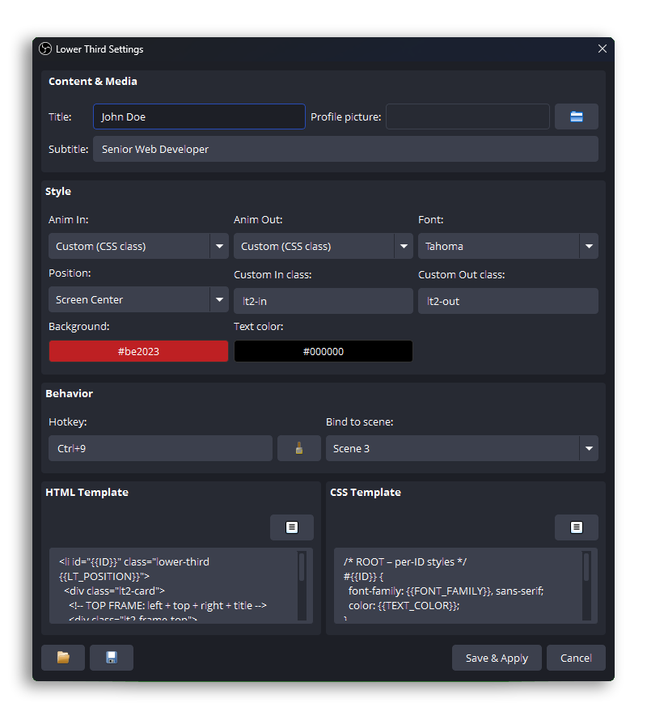

# Smart Lower Thirds - Professional OBS Studio Plugin  

   
  

**Create, manage, automate, and display unlimited lower thirds with a fully integrated local webserver.**

---

## 🚀 Overview  
**Smart Lower Thirds** is a next-generation plugin for OBS Studio designed for creators who want **clean, dynamic, and professional broadcast graphics** without needing external tools or HTML editing.

Whether you stream, present, teach, interview guests, or run live shows this plugin gives you **total creative control** over your on-screen identity.

---

## ⭐ Core Features

### ➤ Create Unlimited Lower Thirds  
There is **no limit** to how many lower thirds you can build.  
Use them for:
- Host / guest names  
- Social media tags  
- Topics & talking points  
- Announcements  
- Scene-specific identifiers  
- Event or show branding  

Each lower third is **fully independent** and customizable.

---

### ➤ Built-In Local Webserver  
The plugin includes a fully integrated local webserver that:
- Serves your lower-thirds to OBS Browser Sources  
- Keeps all scenes synchronized  
- Requires **no external files**  
- Allows instant reload & preview  

Once enabled, the plugin automatically creates a persistent Browser Source pointing to:  
`http://127.0.0.1:8089/smart-lower-thirds.html`

---

## 🎛️ Professional Settings Dialog  

Smart Lower Thirds includes a polished configuration window with clear explanations for every option.

> _Dock & main interface:_

> _Settings dialog with full control over style and behavior:_

### Key settings include:
- **Animation Controls**  
  Choose from multiple enter/exit animations powered by **Animate.css**.  
- **Typography & Style**  
  Select fonts, sizes, weights, colors, backgrounds, and padding.  
- **Avatar Controls**  
  Upload a profile picture per lower third with automatic failover.  
- **Positioning & Anchoring**  
  Bottom-left, bottom-right, center, top-left, top-right, and custom offsets.  
- **Timing / Auto-Hide Options**  
  Configure auto-hide delays, transition durations, and visibility rules.  

Everything is explained inside the dialog, making setup intuitive even for beginners.

---

## 🧩 Placeholder System  

Lower thirds support dynamic placeholders you can insert anywhere in the HTML or CSS templates:

| Placeholder | Description |
|------------|-------------|
| `{{TITLE}}` | Main text such as name, topic, headline |
| `{{SUBTITLE}}` | Secondary text, role, description |
| `{{PROFILE_PICTURE}}` | Avatar image file name / URL |
| `{{ID}}` | Unique instance ID used for animations |
| `{{LT_POSITION}}` | Selected position class |
| `{{BG_COLOR}}`, `{{TEXT_COLOR}}` | Dynamic styling injected from settings |

These allow full customization and easy theming.

---

## 📥 Import & Export Templates  

You can **export any lower third** to a `.zip` template and share it with others or import templates from your team, community, or future bundles.

- Templates include:  
  ✔ Layout  
  ✔ CSS  
  ✔ Animation config  
  ✔ Avatar settings  
  ✔ Colors & fonts  

- Powered by **minizip**, the process is fast, stable, and compatible across platforms.

This makes Smart Lower Thirds a perfect tool for creators, agencies, and e-sports productions who need consistent branding.

---

## 🎚️ Hotkeys & Scene Binding  

Smart Lower Thirds gives you full control over when each lower third appears through **OBS hotkeys** and **scene-based automation**.

### 🔥 Hotkey Integration  

Each lower third can be assigned one or more OBS hotkeys, allowing you to:
- Show / hide a lower third instantly  
- Toggle animations on demand  
- Trigger lower thirds from keyboards, Stream Decks, macro pads, or any supported controller  

Hotkeys are perfect for live productions where timing and precision matter.

### 🎬 Scene Binding  

Lower thirds can also be **automatically shown** or **hidden** when switching scenes:

- Enter a scene → show the bound lower third  
- Leave a scene → hide or animate it out  

This is ideal for interviews, multi-topic shows, gaming overlays, and professional studio setups.

---

### ❗ Important Behavior  

Whether a lower third is triggered via **hotkeys** or **scene binding**, the plugin will automatically **hide all other active lower thirds** to ensure only the intended one is displayed.

If you want **multiple lower thirds visible at the same time**, you must enable them **manually from the dock**, giving you full compositional control and preventing overlap.

---

## 📚 Multiple Lower Thirds Per Scene  

Yes you can have **several** lower thirds active simultaneously:
- One for the host  
- One for the guest  
- One for the topic  
- One for social media  
- One for call-to-action messages  

All animations are isolated and work independently.

---

## 🧩 Extreme Flexibility  

Smart Lower Thirds is built to be:
- **Versatile** – hundreds of visual combinations  
- **Lightweight** – minimal performance impact  
- **Modular** – each part is optional  
- **Theme-friendly** – custom CSS, HTML masks, animations  
- **Scalable** – works for small creators and professional studios  

---

## 📖 Bibliography & Credits  

This plugin uses the following open-source resources:

### **Animate.css**  
For smooth CSS animations  
🔗 https://github.com/animate-css/animate.css  

### **MiniZip**  
For import/export template packaging  
🔗 https://github.com/domoticz/minizip  

Thank you to these developers for their amazing contributions please show some love and leave a star on these repos.

---

## ❤️ Support the Project  

If you want to support the development of Smart Lower Thirds and future OBS tools:

**Lower Thirds Shop** https://ko-fi.com/mmltech/shop
**Ko-fi:** https://ko-fi.com/mmltech  
**PayPal:** https://paypal.me/mmlTools  

Your help keeps the project alive.

---

## 📦 Installation  

1. Download the plugin for your platform  
2. Extract / run the installer  
3. Relaunch OBS Studio  
4. Add **Smart Lower Thirds** from the *Docks* menu (make sure the indicator is green)  
5. Add the Browser Source  
6. Start creating your lower thirds!

---

### Created with ❤️ by **MML Tech**  
Perfect for streamers, creators, agencies, and professional broadcasters.
